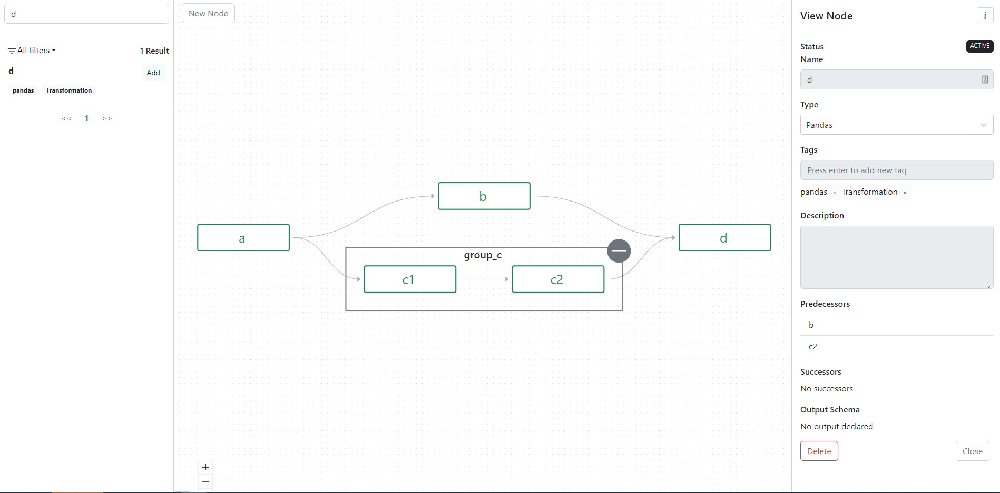

# Graph Catalog UI

Calling `<node>.html()` on the end node of a pipeline brings up a graph of the pipeline in the Graph Catalog UI. This is 
helpful for seeing the structure of a pipeline, and is particularly helpful with complex pipelines that comprise dozens 
of nodes. Each node/edge is able to be interacted with in the UI to see details such as descriptions, source code, tags, 
etc. 

``` py
# Pipeline definition

import pandas as pd
from flypipe import node


@node(
    type='pandas',
)
def a():
    return pd.DataFrame({'a': [1,2,3]})

@node(
    type='pandas',
    dependencies=[a]
)
def b(a):
    return a

@node(
    type='pandas',
    dependencies=[a],
    group="group_c"
)
def c1(a):
    return a

@node(
    type='pandas',
    dependencies=[c1],
    group="group_c"
)
def c2(c1):
    return c1

@node(
    type='pandas',
    dependencies=[b, c2]
)
def d(b, c2):
    return pd.concat([b, c2], axis=1)
```

``` py
# Visualise the pipeline by invoking the html method
# Note- in Databricks there's a displayHTML that allows for direct rendering of html:
displayHTML(d.html(height=850))
# Outside of Databricks, we'll need to put the output into a html file and load it in a browser: 
with open('test.html', 'w', encoding='utf-8') as f:
    f.write(d.html(height=850))
# <open test.html in browser after running this>
```



Note by giving an input sections of the graph can be skipped, this shows on the visualisation with the relevant nodes 
being marked as skipped and their edges being marked differently. 
