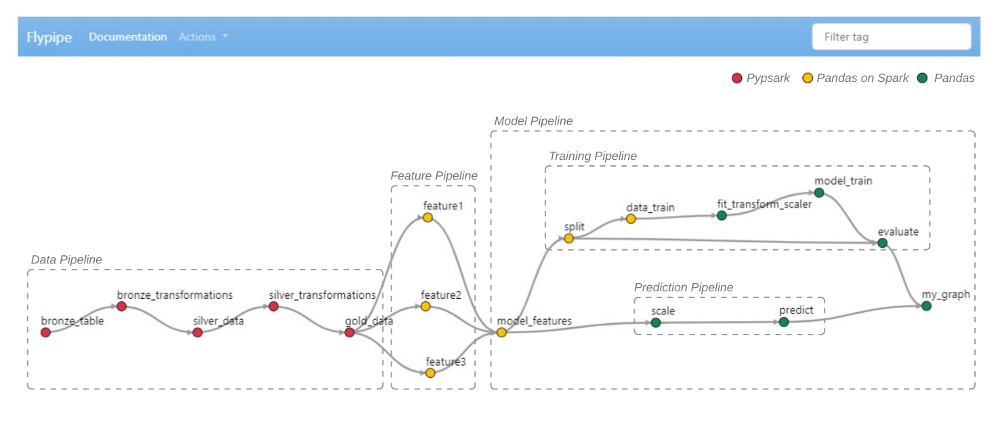

# Flypipe

The Data/Machine Learning/Data Science space heavily leverages pipelines. These pipelines typically involve a chain of 
transformations on data stored in Pandas/PySpark dataframes to clean, filter, etc the data into a useful form. 

Flypipe is a Python framework to simplify development, management and maintenance of these pipelines. At its heart it 
involves the simple concept of splitting a pipeline into logical transformations/nodes and defining relationships 
between these nodes. The Flypipe framework then uses this information to build a Directed Acyclic Graph (DAG). 

```python
from flypipe.node import node


@node(
  type="pandas",
  dependencies=[t0.select("fruit").alias("df")]
)
def t1(df):
  categories = {'mango': 'sweet', 'lemon': 'citric'}
  df['flavour'] = df['fruit']
  df = df.replace({'flavour': categories})
  return df
```

### Flypipe Pipelines

As each node (transformation) is connected to its ancestors, you can easily see the pipeline (`my_graph.html()`) or execute it
by invoking `my_graph.run()`



## What Flypipe aims to facilitate?

- End-to-end logic lineage for transformations
- Create development standards for Data Engineers, Machine Learning Engineers and Data Scientists
- Improve re-usability of transformations in different pipelines
- Faster integration and portability of pipelines to non-spark APIs
- Low latency for on demand feature generation and predictions

## Other Flypipe advantages

* Break down feature transformations into smaller pieces.
    - Composable transformations
    - Numerous, smaller transformations are easier to reason about 
    - Smaller transformations doing a single operation and framework supported dependency injection make unit testing easy
    - Dependency injection also makes on the fly transformations possible
    - Graph allows for lineage visibility and far better high level table views over the pipeline
* Flexibility to use and mix up pyspark/pandas on spark/pandas/spark_sql in transformations
* Write once, use in a variety of contexts
* Very lightweight, easy to integrate into Databricks, or can be used without Databricks also
* Framework level optimisations and cool things like dynamic transformations