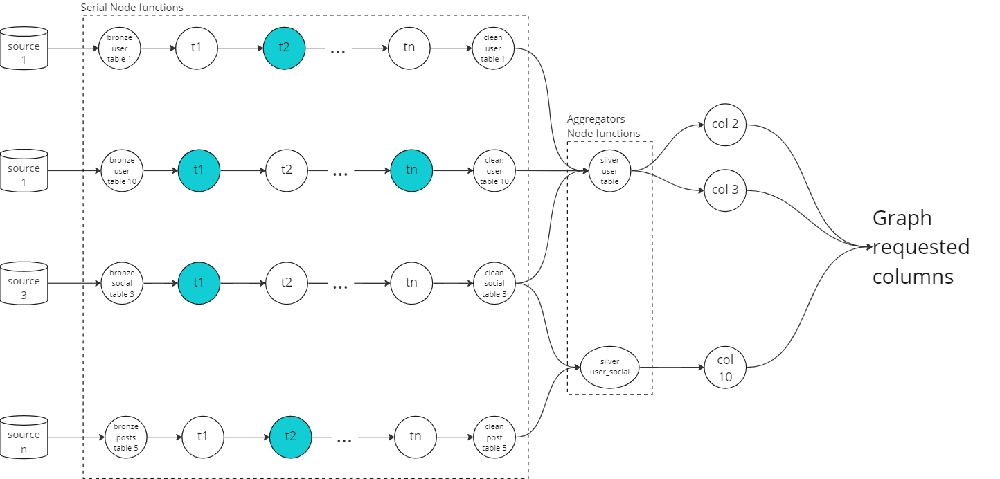

# Aggregator

## The problem

You have to aggregate multiple data sources and tables into a single data layer.

Example:

You have multiple tables with users and user social network information but in different data sources and you want to
consolidate and union all this information into a single table `user` and `user_social`.

### Challenges

- These tables can have mixed information of user and social network, and same table can be used to `user`
  and `user_social`
- These tables can have a lot of columns and transformations, therefore `parallel` data design pattern can create a lot
  of joins
- You only want to process the transformations necessary for the requested columns from the graph (in case of *on the
  fly* transformations)
- The graph can be complex to manage each node, need an easier interface to manage renaming of columns and
  transformations

### Approach

