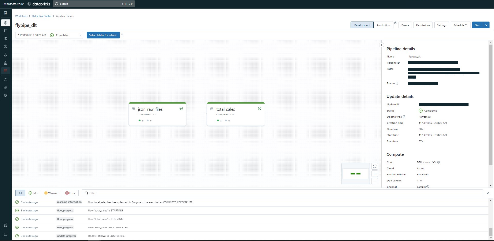

You can integrate Flypipe graphs with [Databricks DLTs](https://www.databricks.com/product/delta-live-tables) (see
the [docs](https://docs.databricks.com/workflows/delta-live-tables/index.html)).

The advantage of using Flypipe with DLTs is you can use Flypipe to manage and develop your transformations and pipeline.
Once finished, any node can be exposed to DLTs workflows.

<a href="_static/html/flypipe_databricks_dlt.html" target="_blank" title="Download Notebook" style="float: right;">
Download Notebook</a>
<iframe style="border:none;" src="../_static/html/flypipe-databricks-dlt.html" width="100%" height="600px"></iframe>

**Create and run a pipeline**

See how to create
a [pipline](https://docs.databricks.com/workflows/delta-live-tables/delta-live-tables-quickstart.html#create-a-pipeline)

