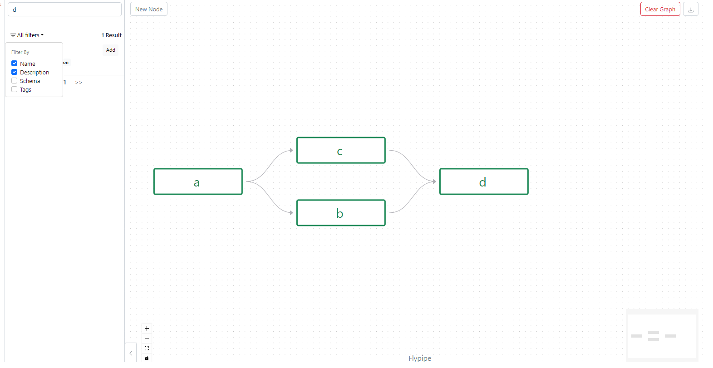
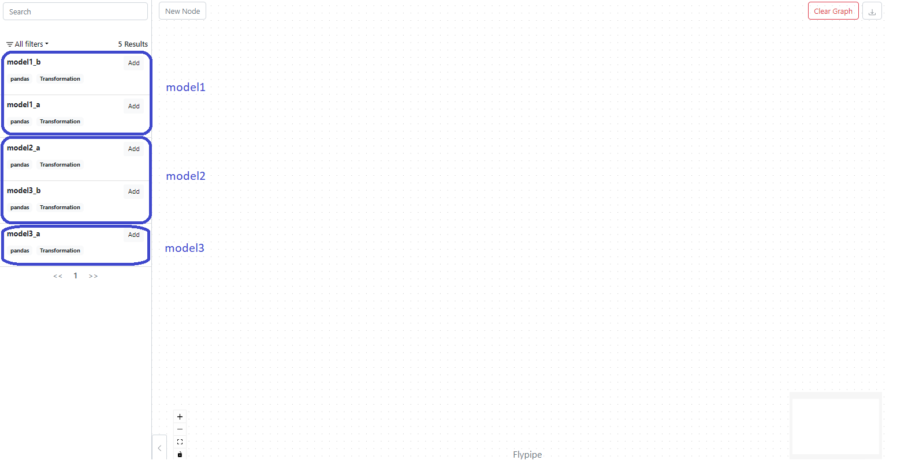
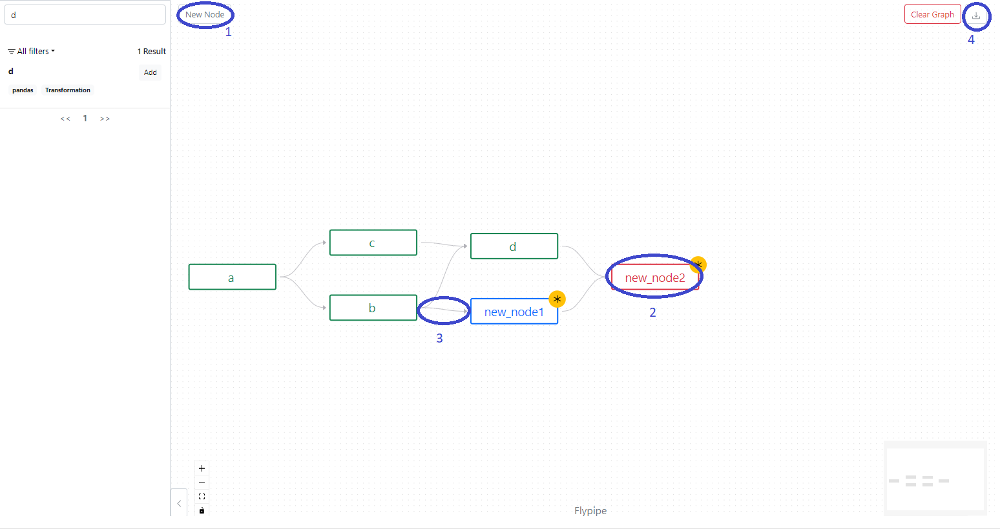

# Catalog

### Introduction

Flypipe has a UI called the Catalog that allows for 3 primary functionalities: 
1. [Visualisation of Pipelines](#visualisation-of-pipelines)
2. [Catalog Search](#catalog-search) 
3. [Build a New Pipeline](#build-a-new-pipeline)

## Visualisation of Pipelines

Calling `<node>.html()` on the end node of a pipeline brings up a graph of the pipeline in the Catalog UI. This is 
helpful for seeing the structure of a pipeline, and is particularly helpful with complex pipelines that comprise dozens 
of nodes. Each node/edge is able to be interacted with in the UI to see details such as descriptions, source code, tags, 
etc. 

```
# Pipeline definition

import pandas as pd
from flypipe import node


@node(
    type='pandas',
)
def a():
    return pd.DataFrame({'a': [1,2,3]})

@node(
    type='pandas',
    dependencies=[a]
)
def b(a):
    return a

@node(
    type='pandas',
    dependencies=[a],
    group="group_c"
)
def c1(a):
    return a

@node(
    type='pandas',
    dependencies=[c1],
    group="group_c"
)
def c2(c1):
    return c1

@node(
    type='pandas',
    dependencies=[b, c2]
)
def d(b, c2):
    return pd.concat([b, c2], axis=1)
```

```
# Visualise the pipeline by invoking the html method
# Note- in Databricks there's a displayHTML that allows for direct rendering of html:
displayHTML(d.html(height=850))
# Outside of Databricks, we'll need to put the output into a html file and load it in a browser: 
with open('test.html', 'w', encoding='utf-8') as f:
    f.write(d.html(height=850))
# <open test.html in browser after running this>
```


Note by giving an input sections of the graph can be skipped, this shows on the visualisation with the relevant nodes 
being marked as skipped and their edges being marked differently. 

## Catalog Search

Using the same Catalog as the Visualisation example and looking to the left hand side we can see a panel that allows us 
to use the Catalog search functionality. Existing nodes that are in the Catalog appear here and can be filtered on 
various fields via the search bar at the top. Clicking on a node gives the details and full source code of each. In a 
scenario with dozens or hundreds of nodes/features this can be useful to find out if a node already exists before 
creating one, or simply to assist in navigating the code base in case an IDE like pycharm isn't available.



Important note- in the previous section we built a Catalog object under the hood when we invoked .html on a node. By 
creating a Catalog directly it's possible to add nodes (and implicitly their ancestors) to the Catalog manually which 
makes them available in the Catalog search. It would be advisable in a non-trivial setting where there are many 
pipelines in operation to register each one to a single Catalog instance, and then to simply import and show the 
Catalog via this instance. Otherwise the Catalog search would be limited to operating over the nodes of a single 
pipeline. The example below illustrates this technique: 

```
import pandas as pd
from flypipe import node


@node(
    type='pandas',
)
def model1_a():
    return pd.DataFrame({'a': [1,2,3]})

@node(
    type='pandas',
    dependencies=[model1_a]
)
def model1_b(model1_a):
    return pd.DataFrame({'a': [1,2,3]})

@node(
    type='pandas',
)
def model2_a():
    return pd.DataFrame({'a': [1,2,3]})

@node(
    type='pandas',
)
def model3_a():
    return pd.DataFrame({'a': [1,2,3]})

@node(
    type='pandas',
    dependencies=[model3_a]
)
def model3_b():
    return pd.DataFrame({'a': [1,2,3]})

from flypipe.catalog import Catalog

my_catalog = Catalog()
# Register all 3 models onto the Catalog instance
my_catalog.register_node(model1_b)
my_catalog.register_node(model2_a)
my_catalog.register_node(model3_b)

# The catalog definition above we could place into it's own module and simply use from module import my_catalog when we 
# wanted to show the full Catalog
displayHTML(my_catalog.html())
```



## Build a New Pipeline

Last of all, the Catalog also permits the framework of a new pipeline to be created. 



Operations of interest here are: 
1. Clicking and dragging the "New Node" icon into the graph creates a new blank node.
2. Clicking on a new node brings up a sidebar that allows for modification of any of the Flypipe metadata fields. 
3. By clicking and dragging from the edge of a node in the graph to a new node creates a dependency on the new node to 
the origin node. The dependency can modified to select only a subset of the available columns if the origin node defines 
a schema. Note existing nodes are immutable and new dependencies or alterations cannot be done to them. 
4. Clicking on this button copies the node definitions of the new nodes to the clipboard. We can then paste them into 
our favourite editor and fill out the core logic of each node. Below is an example from the above scenario of the code 
from the new nodes.
```
from flypipe import node

    
@node(
    type='pyspark',
    description='this is a new test',
    tags=['test'],
    dependencies=[new_node1, d]
)
def new_node2(new_node1, d):
    # <implement logic here>


from flypipe import node
    
@node(
    type='pandas_on_spark',
    dependencies=[b]
)
def new_node1(b):
    # <implement logic here>
```